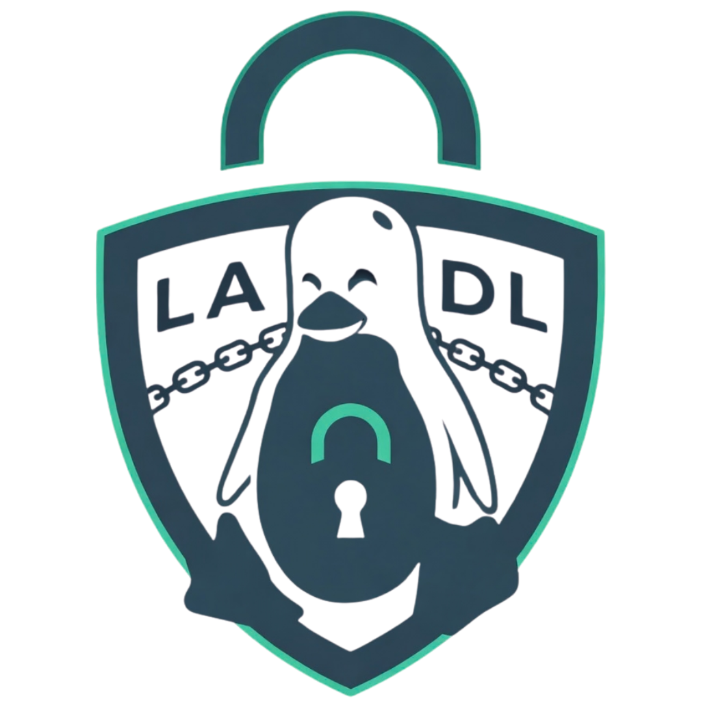

# LADL — Linux Age Distributed Ledger

<p align="center">
  
</p>

<p align="center">
  <strong>Privacy-preserving, decentralized age verification for Linux</strong><br/>
  Zero PII on the network &nbsp;·&nbsp; Two-byte public API &nbsp;·&nbsp; Fourth Amendment compliant by design
</p>

---

## Table of Contents

1. [What is LADL?](#what-is-ladl)
2. [How It Works](#how-it-works)
3. [Response Encoding](#response-encoding)
4. [Installation](#installation)
5. [Quick Start](#quick-start)
6. [Running as a Service](#running-as-a-service)
7. [CLI Reference](#cli-reference)
8. [Configuration](#configuration)
9. [HTTP API](#http-api)
10. [Privacy Model](#privacy-model)
11. [Architecture](#architecture)
12. [Building from Source](#building-from-source)
13. [License](#license)

---

## What is LADL?

LADL is a single Go binary that cryptographically binds a user's age attestation
to their local Linux account, assigns them a permanent anonymous UUID, and
publishes a minimal record to the Linux Age Distributed Ledger — a peer-to-peer
gossip network built on [Strata L4](https://github.com/AndrewDonelson/Strata).

Any website or application queries the ledger with a UUID and receives exactly
**two bytes** in return: the age group and the verification level. No name,
birthdate, document image, IP address, or any other identifying information is
ever stored on the ledger or transmitted over the network.

```
GET /q/123e4567-e89b-12d3-a456-426614174000
→ d2
```

---

## How It Works

```
User machine                          LADL Network             Website
─────────────────────────────────     ──────────────────────   ──────────────────
ladl verify --level 1 --group d
  │
  ├─ Generate Ed25519 keypair (once)
  ├─ Derive UUID from public key
  ├─ Sign age-group claim with priv key
  └─ Publish {UUID → "d1"} to ledger ─────────────────────────────────────────▶
                                                                 GET /q/{UUID}
                                                               ◀─────────────────
                                                                 "d1"
                                                                 allow/deny
```

### Verification Levels

| Level | Name | How it works | Trust |
|-------|------|-------------|-------|
| `1` | Self-Attested | You declare your own age group | Low |
| `2` | Document-Assisted | OCR reads a government ID *on your machine only* — the document never leaves | Medium |
| `3` | Verifiable Credential | A W3C VC from a trusted issuer cryptographically attests your age | High |

---

## Response Encoding

The public query response is always exactly **two bytes**: `{group}{level}`.

### Age Group Codes

| Byte | Label | Age Range | Typical Use |
|------|-------|-----------|-------------|
| `-` | No record | — | UUID registered, no age claim made |
| `a` | Under 13 | 0–12 | COPPA territory; restrict all adult content |
| `b` | Teen | 13–17 | Minor; no adult content or purchases |
| `c` | Adult | 18–20 | Adult content; no alcohol or cannabis |
| `d` | Full Adult | 21+ | No restrictions |

### Verification Level Codes

| Byte | Name | Trust |
|------|------|-------|
| `0` | Unverified | Account registered, no age claimed |
| `1` | Self-Attested | Low |
| `2` | Document-Assisted | Medium |
| `3` | Verifiable Credential | High |

### Example Application Logic

```
"d2"  → group d (21+), level 2 (document-verified)  → allow
"c1"  → group c (18–20), level 1 (self-attested)    → allow for adult content, deny if site requires doc-verified
"b1"  → group b (teen)                               → deny
"-0"  → registered, no age claimed                  → deny, prompt to run ladl verify
404   → UUID unknown                                 → deny, prompt to register
```

---

## Installation

### Pre-built binary

```bash
# Download the latest release
curl -LO https://github.com/AndrewDonelson/ladl/releases/latest/download/ladl-linux-amd64
chmod +x ladl-linux-amd64
sudo mv ladl-linux-amd64 /usr/local/bin/ladl
```

### From source

```bash
git clone https://github.com/AndrewDonelson/ladl
cd ladl
make install          # builds and installs to /usr/local/bin/ladl
```

---

## Quick Start

### 1. Register and self-attest your age group

```bash
# Interactive — prompts for your age group (a/b/c/d)
ladl verify

# Or non-interactive
ladl verify --level 1 --group d
```

### 2. Check your UUID

```bash
ladl uuid
# → 123e4567-e89b-12d3-a456-426614174000
```

### 3. Check your current verification status

```bash
ladl status
# → d1
```

### 4. Upgrade to document-assisted (Level 2)

```bash
ladl verify --level 2 --document /path/to/drivers-license.jpg
```

### 5. Back up your identity

```bash
ladl export-identity --output ~/ladl-backup.key
# Prompts for a passphrase — store the file securely
```

### 6. Restore your identity on another machine

```bash
ladl import-identity --input ~/ladl-backup.key
# Prompts for the passphrase used during export
```

---

## Running as a Service

LADL runs as two distinct modes depending on your deployment role.

### Peer Mode (default)

Handles verification for users on a single machine. Exposes a **localhost-only**
HTTP API. Does not store the full chain.

```bash
# Run directly
ladl --port 7743 --config /etc/ladl/config.yaml

# Or with systemd (see deploy/ directory for unit file)
sudo systemctl enable --now ladl
```

### Ledger Mode

Runs a full LADL node: stores the full chain, syncs with peers, and serves the
public query API on all interfaces.

```bash
ladl --ledger --port 7743 --config /etc/ladl/config.yaml
```

---

## CLI Reference

```
ladl [flags]                              Run as service daemon (peer mode)
ladl --ledger [flags]                     Run as full ledger node

Global flags:
  --config string   Config file path (default: /etc/ladl/config.yaml)
  --ledger          Run as full LADL ledger node
  --port  int       HTTP listen port (default: 7743)

Subcommands:
  verify            Perform age verification (levels 1–3)
  status            Print the current verification status (e.g. d2)
  uuid              Print the local identity UUID
  export-identity   Export an AES-256-GCM encrypted keypair backup
  import-identity   Restore a keypair from an encrypted backup
  revoke            Revoke the current identity on the ledger
  version           Print build version information
```

### `ladl verify`

```
ladl verify [flags]

  --level int       Verification level: 1=self-attest, 2=document OCR, 3=VC (default: 1)
  --group string    Age group: a, b, c, or d (level 1 only)
  --document string Path to document image (level 2 only)
```

### `ladl export-identity`

```
ladl export-identity [flags]

  --output string   Output file path (default: ~/ladl-backup.key)
```

### `ladl revoke`

Revokes the identity, removing the UUID from the ledger. The local keypair is
deleted. **This is irreversible.** The user must re-run `ladl verify` to
create a new identity.

```
ladl revoke [--force]

  --force   Skip the confirmation prompt
```

---

## Configuration

Default config file: `/etc/ladl/config.yaml`

```yaml
service:
  port: 7743
  identity_dir: ~/.config/ladl

strata:
  l4:
    enabled: true
    mode: peer           # "peer" or "ledger"
    port: 7744
    max_peers: 50
    quorum: 3
    sync_interval: 30s
    bootstrap_peers:
      - ladl.example.com:7744
    dns_seed: ""
```

---

## HTTP API

### Peer Mode (localhost only — `127.0.0.1:7743`)

| Method | Path | Description |
|--------|------|-------------|
| `GET` | `/uuid` | Returns the local identity UUID |
| `GET` | `/status` | Returns the current two-byte verification status |
| `POST` | `/verify` | Submits a verification request |
| `POST` | `/revoke` | Revokes the current identity |

#### `POST /verify`

```json
{
  "level": 1,
  "group": "d",
  "document_path": ""
}
```

Response: `d1` (plain text, two bytes)

#### `GET /status`

Response: `d2` (plain text, two bytes) or `404` if no identity exists.

### Ledger Mode (public — `0.0.0.0:7743`)

| Method | Path | Description |
|--------|------|-------------|
| `GET` | `/q/{uuid}` | Query the verification record for a UUID |
| `GET` | `/peers` | List connected peers |
| `POST` | `/sync` | Trigger a manual sync with peers |

#### `GET /q/{uuid}`

```
HTTP 200  →  d2         (two bytes, plain text)
HTTP 404  →  (empty)    UUID not known to this ledger node
HTTP 429  →  (empty)    Rate limit exceeded
```

Rate limits: 100 requests/minute, 1000 requests/hour per IP address.

---

## Privacy Model

### What the ledger stores (per UUID)

```json
{ "g": "d", "l": 2, "t": "2026-03" }
```

One letter, one digit, one coarse month/year timestamp. Nothing else.

### What the ledger never stores

- Name, email, or any personal identifier
- Birthdate or document data
- Linux username, UID, or machine ID
- IP address of any user or machine
- Any mapping between two UUIDs

### UUID Privacy Guarantee

A UUID is derived from the user's Ed25519 public key via SHA-256. The derivation
is one-way: given a UUID it is computationally infeasible to recover the keypair
or to link it to a Linux account. The **only** party that can associate a UUID
with a real person is the user themselves.

### Legal

LADL is explicitly designed to comply with age-verification mandates such as
California AB 2273 while minimising the privacy cost to users. The public ledger
record (`d2` + UUID) is not PII under any current legal definition. Linking a
UUID to a person requires physical or compelled access to the user's machine —
warrant-level access under *Carpenter v. United States* (2018).

---

## Architecture

```
cmd/               Cobra CLI commands (daemon, verify, status, uuid, export, import, revoke, version)
internal/
  api/             HTTP handlers — local (localhost-only) and ledger (public) APIs
  config/          YAML configuration loading
  errors/          Shared sentinel error values
  format/          Two-byte {group}{level} encoding and parsing
  identity/        Ed25519 keypair generation, UUID derivation, load/save, AES-256-GCM backup
  ledger/          Strata L4 wrapper — Publish, Query, Revoke
  verification/    Level 1/2/3 verification flows and signing
main.go            Entry point
```

Depends on [Strata L4](https://github.com/AndrewDonelson/Strata) for the
peer-to-peer transport and distributed ledger layer.

---

## Building from Source

```bash
git clone https://github.com/AndrewDonelson/ladl
cd ladl

# Build
go build -ldflags "-X cmd.BuildVersion=0.1.0 -X cmd.BuildDate=$(date -u +%Y-%m-%d)" -o ladl .

# Run tests
go test ./...

# Run with coverage
go test ./internal/... -coverprofile=coverage.out -coverpkg=./internal/...
go tool cover -func=coverage.out
```

**Requirements:** Go 1.21+, Linux (amd64 or arm64), Tesseract OCR (optional, for Level 2)

---

## License

Licensed under **AGPL-3.0** for individuals and open-source use.

A commercial license is required for government, corporate, and foundation use.
Contact [licensing@nlaakstudios.com](mailto:licensing@nlaakstudios.com) for
details.

See [LICENSE](LICENSE) and [LICENSE-COMMERCIAL.md](LICENSE-COMMERCIAL.md).